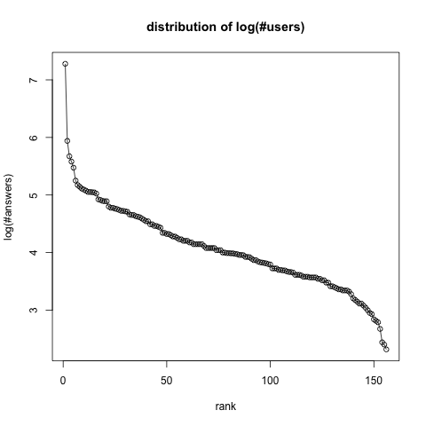
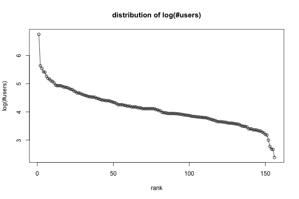
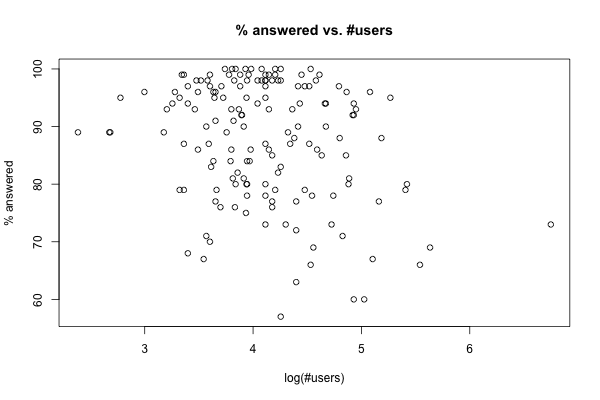

# Stackexchange Analysis #

## Overview ##
This repository contains one python script and a few R scripts for the quick
analysis of stackexchange sites. The analysis uses the publicly information
available on [http://stackexchange.com/sites](http://stackexchange.com/sites), 
containing the following statistics for each site:

- Number of users
- Number of questions asked
- Number of questions answered
- Percentage of questions answered

## Motivation ##
Stackexchange ([http://stackexchange.com/](http://stackexchange.com/)) was
founded in 2008 as a question-answer site for computer programming questions. In the early days it was called Stack Overflow. The success of the site lead the
founders to branch out beyond computer programming questions and apply their model to other topics. Now more than hundred such topics are covered.

Since stackoverflow is the oldest of the Stackexchange sites it is also the
one with the most users and answers.

## Analysis ##

## Directory structure ##
### `get.py` ###
This script downloads [http://stackexchange.com/sites](http://stackexchange.com/sites), parses it and extracts the statistics for each stackexchange site. 

The result is written to the file `stackexchange.csv` in tab delimited format, and the result is also written to `stackexchange.xlsx` for consumption 
in MS Excel.

### `load.R` ###
Load and format the output of `get.py` and save the R data.frame with name
`stackexchange` in the file in stackexchange.RData.

### `analysis.R` ###
The data.frame prepared by `load.R` is loaded and a couple of graphs
are generated.

### `Makefile` ###
Type `make analysis` to run everything.

### `images/` ###
The graphs generated by `analysis.R` are saved here.

## Dependencies ##
- BeautifulSoup4 [https://www.crummy.com/software/BeautifulSoup/bs4/doc/](https://www.crummy.com/software/BeautifulSoup/bs4/doc/)
- requests
- xlsxwriter [http://xlsxwriter.readthedocs.io](http://xlsxwriter.readthedocs.io)

## License ##
GPL V. 3