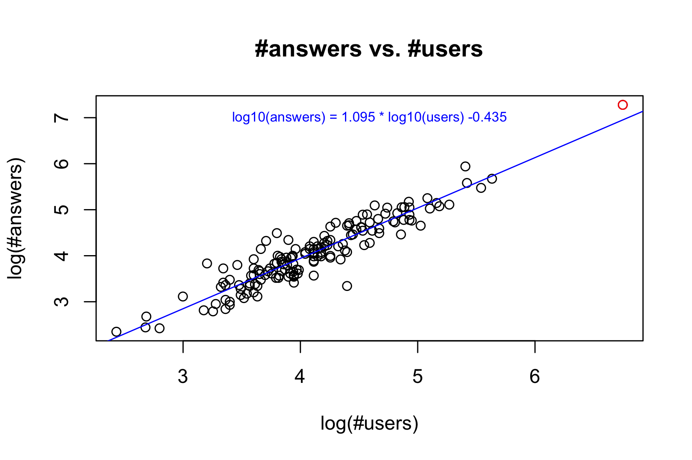
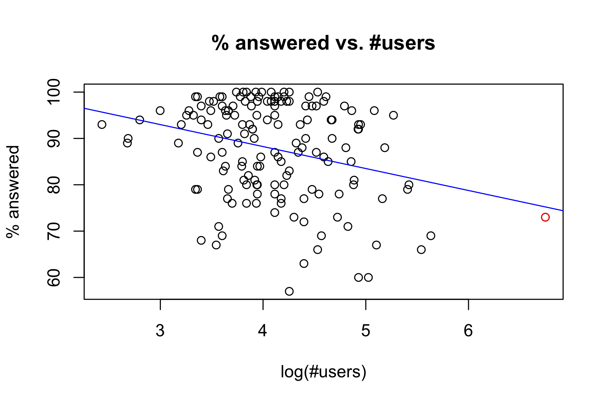
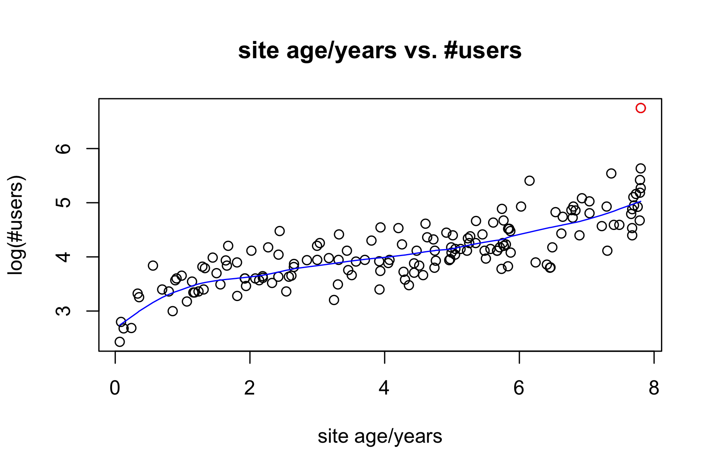

# Stackexchange Analysis #

## Overview ##
This repository contains one python script and a few R scripts for the quick
analysis of stackexchange sites. The analysis uses the publicly information
available on [http://stackexchange.com/sites](http://stackexchange.com/sites),
containing the following statistics for each site:

- Number of users
- Number of question
- Number of answers
- Percentage of questions marked as answered
- Link to site

In addition, the questions page of each site is downloaded
(two downloads, actually) in order to extract the date of the first
question. This date identifies the age of the site.

## Motivation ##
Stackexchange ([http://stackexchange.com/](http://stackexchange.com/)) was
founded in 2008 as a question-answer site for computer programming questions. In the early days it was called Stack Overflow. The success of the site lead the
founders to branch out beyond computer programming questions and apply their model to other topics. Now more than hundred such topics are covered.

Since stackoverflow is the oldest of the Stackexchange sites it is also the
one with the most users and answers. The following has a very quick analysis
of the relationships between:

- the number of users,
- the number of questions asked,
- the number of answers given, 
- the percentage of questions marked as answered, and
- the age of the site (years since first question asked).

## Analysis ##
### Quantiles of log(#answers) and log(#users) ###
Stackoverflow dominates the whole Stackexchange ecosystem. By any of the
extensive measures (#users, #questions, #answers) Stackoverflow is more than
ten times bigger than the next biggest (Super User).

Since stackoveflow site is so dominant it is identified as a red point
in all the scatterplots.

### Relationships between #questions, #answers, #users ###
The linear relationship is quite good:

### Percentage marked as answered vs. #questions ###
The percentage of questions answered varies hugely, and there is a weak
negative correlation between the percentage of questions marked as answered
and the number of users.

### Age vs. #users ###

## Directory structure ##
### `get.py` ###
This script downloads [http://stackexchange.com/sites](http://stackexchange.com/sites), parses it and extracts the statistics for each stackexchange site.

The result is written to the file `stackexchange.csv` in tab delimited format, and the result is also written to `stackexchange.xlsx` for consumption
in MS Excel.

The download is throttled and takes about 10 min for 150 sites.

### `load.R` ###
Load and format the output of `get.py` and save the R data.frame with name
`stackexchange` in the file in stackexchange.RData.

### `analysis.R` ###
The data.frame prepared by `load.R` is loaded and a couple of graphs
are generated.

### `Makefile` ###
Type `make analysis` or `make` to run everything. Note that the download
of all the data is throttled and takes about 10 min.

### `images/` ###
The graphs generated by `analysis.R` are saved here.

## Dependencies ##
- BeautifulSoup4 [https://www.crummy.com/software/BeautifulSoup/bs4/doc/](https://www.crummy.com/software/BeautifulSoup/bs4/doc/)
- Selenium [http://selenium-python.readthedocs.io/](http://selenium-python.readthedocs.io/)
- xlsxwriter [http://xlsxwriter.readthedocs.io](http://xlsxwriter.readthedocs.io)

## Legal ##
#### *Network Content* and *Subscriber Content* ####
In the [Network Terms of Service](http://stackexchange.com/legal)
Stackexchange distinguishes between *Network Content* and 
*Subscriber Content*.
What exactly constitutes network content is not really clear. 
Presumably, network content is whatever is not subscriber content.

The subscriber content has a Creative Commons license:
> ... [A]ll Subscriber Content ... is perpetually and irrevocably licensed to Stack 
> Exchange under the Creative Commons Attribution Share Alike license.

This means the content can be changed and adapted to any purpose by 
Stackexchange, and anyone else, as long as appropriate credit is given and changes are identifiable. In fact, the terms of service explicitly
mentions these rights:

> Subscriber may download or copy the Content, and other items 
> displayed on the Network for download, for personal use, provided that
> Subscriber maintains all copyright and other notices contained in such 
> Content.

When it comes to network content the following paragraph 
determines the legality of the present work:

> Subscriber may download or copy the Content, and other items displayed 
> on the Network for download, for personal use, provided that Subscriber
> maintains all copyright and other notices contained in such Content.

Finally, the terms of service prohibit

> [a]ny fraudulent, abusive, or otherwise illegal activity ...

#### Conclusion ####
My interpretation, in a nutshell, is this: Information can be downloaded 
in a non-abusive way for personal use. 
Since I'm not a lawyer all I can do is to advise you: 
**Read the terms yourself and make your own judgement!**

## License ##
Copyright &copy; 2016 Markus Mayer.

The programs are free software; you can redistribute them and/or modify them under the terms of the **GNU General Public License** as published by the Free Software Foundation; either version 3 of the License, or (at your option) any later version.

The programs are distributed in the hope that they will be useful, but WITHOUT ANY WARRANTY; without even the implied warranty of MERCHANTABILITY or FITNESS FOR A PARTICULAR PURPOSE. See the GNU General Public License for more details.

You should have received a copy of the GNU General Public License along with this program; if not, see <http://www.gnu.org/licenses>.